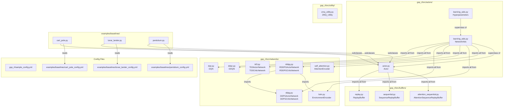

# GSP-RL Architecture

## Module Dependency Graph

## Narrative

### Three Core Packages

The codebase is organized into three packages under `gsp_rl/src/`.

`actors/` is the agent layer. `learning_aids.py` defines two classes in a linear inheritance chain: `Hyperparameters` unpacks a raw YAML dict into named attributes, and `NetworkAids` extends it with factory methods for every supported algorithm plus the full training loop implementations (`learn_DQN`, `learn_DDPG`, `learn_RDDPG`, etc.). `actor.py` defines `Actor`, which extends `NetworkAids` and owns two network dicts — `self.networks` for the primary policy and `self.gsp_networks` for the optional GSP sub-policy — along with `build_networks`, `choose_action`, `learn`, and checkpoint I/O.

`networks/` contains plain PyTorch `nn.Module` subclasses, one file per algorithm family. No wrapper classes or registries: `dqn.py`, `ddqn.py`, `ddpg.py`, `td3.py`, `lstm.py`, `rddpg.py`, `self_attention.py`. All are exported flat from `networks/__init__.py` and imported directly by `NetworkAids`.

`buffers/` contains three experience replay implementations. `replay.py` (`ReplayBuffer`) handles both discrete and continuous action spaces via a `type` flag. `sequential.py` (`SequenceReplayBuffer`) stores fixed-length observation sequences for recurrent GSP. `attention_sequential.py` (`AttentionSequenceReplayBuffer`) stores `(sequence, label)` pairs for supervised attention training.

### Config-Driven Design

The entry point for every experiment is a YAML file. Per-example configs (e.g., `examples/baselines/cart_pole_config.yml`) extend `gsp_rl/sample_config.yml`'s hyperparameter keys with environment-specific fields: `LEARNING_SCHEME`, `INPUT_SIZE`, `OUTPUT_SIZE`, and GSP flags. Example scripts load the YAML with `yaml.safe_load`, build a flat `nn_args` dict from it, and pass `config=config` alongside the rest into `Actor.__init__`. `Hyperparameters.__init__` then unpacks all training hyperparameters from that dict. Algorithm selection (`build_networks`) and buffer allocation happen inside `Actor.__init__` based on the string value of `nn_args['network']`.

### GSP Augmentation Pattern

GSP (Goal State Prediction) adds a parallel sub-policy that predicts a future environment property (e.g., the pole angle at the next timestep). When a GSP variant is enabled, `Actor.__init__` calls `build_gsp_network` in addition to `build_networks`, populating `self.gsp_networks` alongside `self.networks`. At each environment step the example script calls `choose_action(gsp_obs, self.gsp_networks)` to get a scalar prediction, appends it to the raw observation with `np.append(state, gsp_prediction)`, and passes the augmented observation to the primary `choose_action(obs, self.networks)`. The two networks train independently through separate replay buffers; `learn()` periodically invokes `learn_gsp()` based on `GSP_LEARNING_FREQUENCY`. Three GSP variants exist: DDPG-GSP (`gsp=True`), RDDPG-GSP (`recurrent_gsp=True`), and Attention-GSP (`attention=True`).

### Utility Package

`utility/zmq_utility.py` (`ZMQ_Utility`) is an external integration layer for CoppeliaSim robotics simulation. It is not imported by any other package in the repo. Callers instantiate it directly and use it to pack/unpack binary ZMQ messages that carry robot observations, actions, and episode-level signals. All message formats are defined as `struct` format strings (`PARAMS_FMT = '8f'`, `OBS_FMT = '31f'`, etc.) with matching field-name lists. This package is irrelevant to the Gymnasium-based baseline examples and is used only in robot simulation experiments.

### Examples as Templates

Each file in `examples/baselines/` (`cart_pole.py`, `lunar_lander.py`, `pendulum.py`) is a self-contained runnable script and a canonical usage template. Each defines a thin subclass of `Actor` that overrides only environment-specific helpers (`make_agent_state`, `make_gsp_state`, `choose_gsp_action`, `build_gsp_reward`) and drives the Gymnasium training loop directly in `if __name__ == "__main__"`. Copying one of these files and adjusting the config path and environment name is the intended starting point for new experiments.

## Design Principles

**Networks as plain dicts, not wrapper classes.** Every `build_*` and `make_*` method in `NetworkAids` returns a plain Python dict keyed by string (e.g., `{'actor': ..., 'target_actor': ..., 'critic': ..., 'replay': ..., 'learning_scheme': 'DDPG', 'learn_step_counter': 0}`). Callers subscript the dict directly. There is no `Policy` or `Algorithm` class that encapsulates these objects.

**Shared `EnvironmentEncoder` between actor and critic in RDDPG.** `NetworkAids.make_RDDPG_networks` (`learning_aids.py:74`) instantiates one `EnvironmentEncoder` instance (`shared_ee`) and passes it to both `RDDPGActorNetwork` and `RDDPGCriticNetwork`. Target networks each get their own separate encoder. This means the actor and critic share LSTM weights during forward passes; their gradients accumulate through the same parameters.

**Factory pattern in `NetworkAids` for all network construction.** No network is ever instantiated outside `NetworkAids`. The `make_*` methods (`make_DQN_networks`, `make_DDPG_networks`, `make_RDDPG_networks`, `make_Attention_Encoder`, etc.) are the sole construction points. `Actor.build_networks` and `Actor.build_gsp_network` delegate entirely to these factories after assembling the appropriate `nn_args` dicts from `self.*` attributes.

**Algorithm dispatch via string matching on `networks['learning_scheme']`.** Every method that branches per-algorithm (`choose_action`, `learn`, `learn_gsp`, `save_model`, `load_model`, `update_network_parameters`) reads `networks['learning_scheme']` and branches on its string value. This string is set unconditionally by `build_networks` immediately after the factory call. Valid values at runtime: `'DQN'`, `'DDQN'`, `'DDPG'`, `'RDDPG'`, `'TD3'`, `'attention'`.
