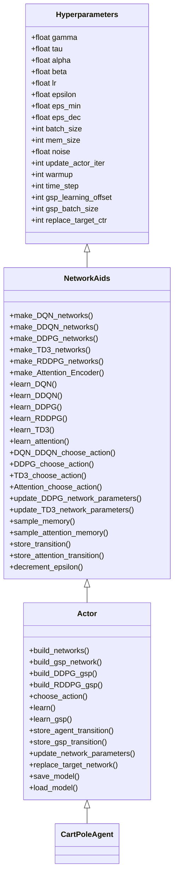
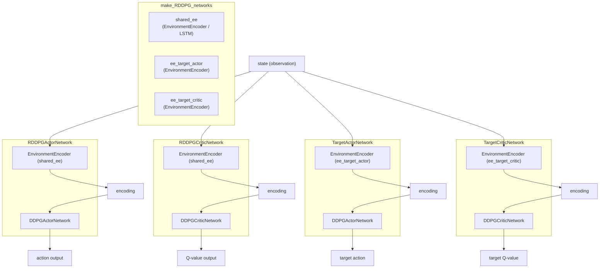
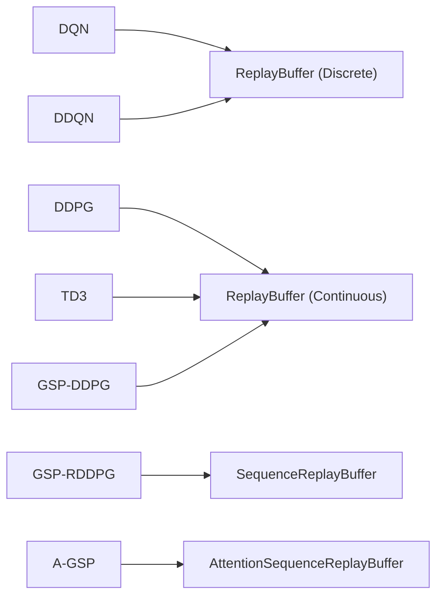

# GSP-RL Class Graph — Layer 2 Context

Layer 2 (class + method level) context graph for LLM loading. Split into four focused sub-diagrams to stay within context window limits.

---

## Sub-diagram A: Inheritance Chain

---

## Sub-diagram B: Network Composition (RDDPG)

---

## Sub-diagram C: Algorithm-to-Buffer Mapping

---

## Sub-diagram D: `networks` Dict Schema

### Main `networks` dict keys per algorithm

| Algorithm | Dict Keys |
|-----------|-----------|
| DQN | `q_eval`, `q_next`, `replay`, `learning_scheme`, `learn_step_counter` |
| DDQN | `q_eval`, `q_next`, `replay`, `learning_scheme`, `learn_step_counter` |
| DDPG | `actor`, `target_actor`, `critic`, `target_critic`, `replay`, `learning_scheme`, `output_size`, `learn_step_counter` |
| TD3 | `actor`, `target_actor`, `critic_1`, `target_critic_1`, `critic_2`, `target_critic_2`, `replay`, `learning_scheme`, `output_size`, `learn_step_counter` |
| RDDPG | Same keys as DDPG (`actor`/`critic` are `RDDPGActorNetwork`/`RDDPGCriticNetwork` wrappers) |

### `gsp_networks` dict keys per GSP variant

| GSP Variant | Dict Keys |
|-------------|-----------|
| DDPG-GSP | `actor`, `target_actor`, `critic`, `target_critic`, `replay` (ReplayBuffer), `learning_scheme`=`'DDPG'`, `output_size`, `learn_step_counter` |
| RDDPG-GSP | Same structure as DDPG-GSP; `learning_scheme`=`'RDDPG'`; `replay` is `SequenceReplayBuffer` |
| A-GSP | `attention`, `replay` (AttentionSequenceReplayBuffer), `learning_scheme`=`'attention'`, `learn_step_counter` |
